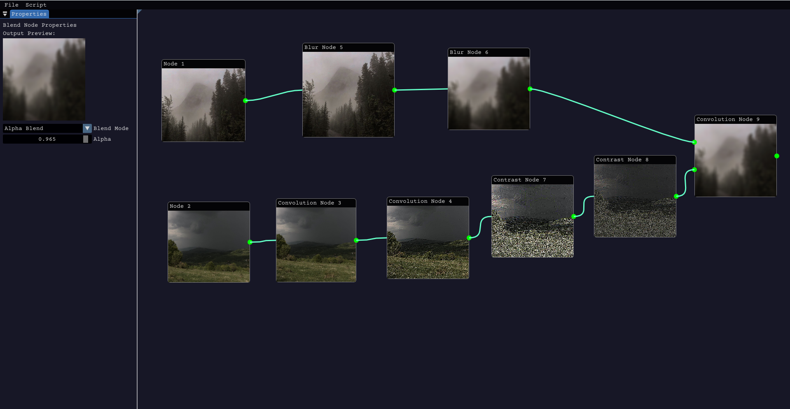

# Node App

## Node-Based Image Manipulation Interface

This project creates a node based interface for image manipulation using a graph like structure in C++. The app allows users to add images, process them through series of nodes such as blur or blend nodes and produces the results through the output node. This interface should function similarly to node-based editors like Substance Designer, where operations are represented visually and can be connected in various configurations. The architecture used here is mediator pattern, the core of the application holds a graph structure that creates connections between nodes and further simplifies the processing done onto the final image.

## Features implemented

I have used libraries like glfw and imgui to create window and gui for the application. I have used the docking branch of the imgui repository so that I can implement dock space to my project. I have used OpenCV to import images and edit textures. I have used OpenGL to simplify Texture generation and can make the processing of more critical nodes easier through Framebuffers.

## Functionality



The application for now is static library based and doesn't use any dynamic linking. The main component the comprises of this application is the NodeManager class which is the central hub for all processing of the graph and GUI connections. The NodeManager is a static class that persists over multiple target classes so that the data exchange can be handled efficiently. Following are the current functionalities of the node editor:

1. Change Brightness

## Build Instructions
I have used CMake and Make to build my project so you should install them first using [CMake](https://cmake.org/download/) and [Make](https://ftp.gnu.org/gnu/make/). You have to install opencv from the official website and build it with mingw to get the static libraries. I am going to make a script file for all the requirements later. Once installed you can use following commands in the project base directory:
```bash
mkdir build
cd build
cmake .. -G "GNU Makefiles"
```

This will install all the dependencies required for the project if required once you build the makefiles. 
``` bash
make
```
This builds the NodeApp.exe you can execute.


## Update Log (11-04-2025)

- Added the OpenCV library to the project and built in a basic UI which doesn't really handles user input that much for now (only open and close)
- The OpenCV integration was hard but I got it out of the way since fetch-content wasn't working with CMake thus I end up installing and building the library manually. I will probably include the instructions for those
- Completed the Node integration now I can add as much node as I want. However they can't be connected for now. Will start with graph structure from today.
- Completed Node sockets now I can connect nodes through bezier curve splines. It is kind of buggy due to ImGui though but works fine. I now have structure graph and then only node editing remains.
- Completed the connections through sockets. The connections are visible as well as they update in the data map. The circular depencies don't exist. Just need to implement all this into the graph now.